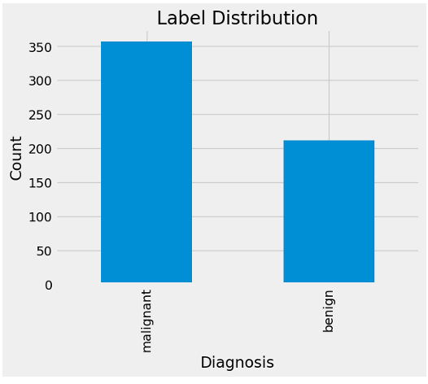

# Breast-Cancer-Prediction-KNN

## Project Overview
This project focuses on building a predictive model to classify breast tumors as **Malignant** or **Benign** using the **K-Nearest Neighbors (KNN)** algorithm. Early detection is a critical factor in medical diagnostics, and this project demonstrates how machine learning can assist in this process with high reliability.

## Technical Methodology
The project follows a structured data science workflow implemented in **Python**:
* **Dataset:** Utilized the Wisconsin Breast Cancer (Diagnostic) dataset.
* **Exploratory Data Analysis (EDA):** Analyzed feature relationships and data distribution using Seaborn and Matplotlib.
* **Data Preprocessing:** Handled feature scaling and split the data into training and testing sets to ensure model generalizability.
* **Model:** Implemented the **KNN Classifier** and optimized its performance.

## Key Results
The model demonstrated excellent performance on the test dataset:
* **Accuracy:** Achieved a high score of **96%**.
* **Model Evaluation:** Detailed performance was validated using a **Classification Report** and **Confusion Matrix**, ensuring high precision and recall for malignant cases.

## Model Performance
### Classification Report

Detailed metrics showing the model's accuracy, precision, and recall scores.

## Repository Contents
* `Breast_Cancer_KNN.ipynb`: The complete Python notebook containing the code, EDA, and model implementation.
* `Breast_Cancer_Predictions.pdf`: A formal research paper documenting the study's methodology and findings.
* `Images/`: Directory containing performance visualizations and evaluation metrics.
* `archive-ics-uci-edu...pdf`: Documentation and details of the original dataset source.
